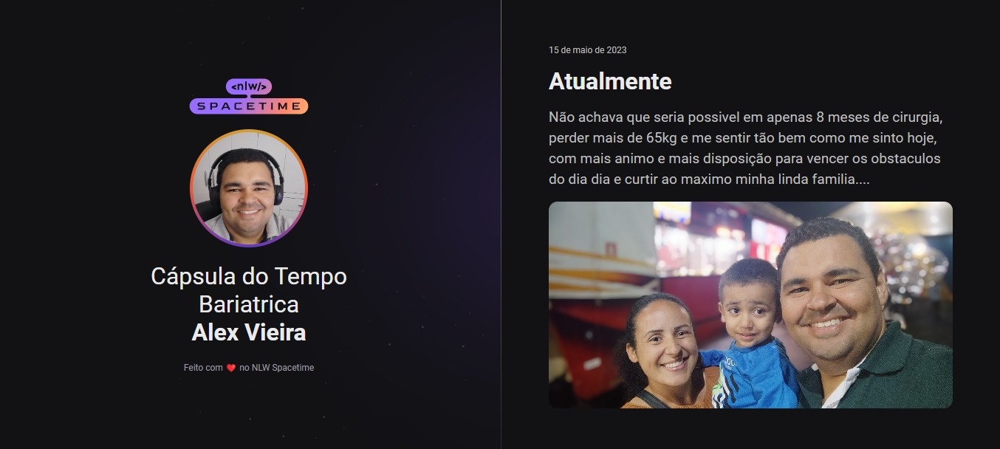

  
  

  #  💻 Projeto

  Nesse projeto web, eu compartilho minha evolução e tambem minhas frustraçãoes com a cirugia bariátrica, que fiz no mes de Setembro de 2022.

  ## 🚀 Tecnologias

  Desenvolvi esse projeto utilizando as seguintes tecnologias:
  -HTML
  -CSS
  -Git e Giyhub

  ## 🔗 Layout

  Se desejar pode acessar esse site através do [link](https://github.com/alexs30/NLW---Spacetime)